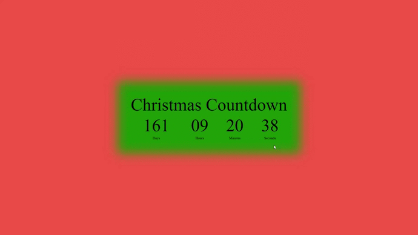

# ⏳🎄 Christmas Countdown 

<h1 align="center">
    
</h1>

## 🔖 Sobre

O projeto **Digital Clock** é um relogio desenvolvido em JavaScript.


## 🚀 Tecnologias utilizadas

O projeto foi desenvolvido utilizando as seguintes tecnologias

- [CSS](https://developer.mozilla.org/pt-BR/docs/Web/CSS)
- [HTML](https://developer.mozilla.org/pt-BR/docs/Web/HTML)
- [JavaScript](https://www.javascript.com/)

## 🗂 Como baixar e iniciar o projeto

```bash

    # Clonar o repositório
    $ git clone https://github.com/miliotte/clock

```

Desenvolvido por👻: [Ricardo Miliotte](https://www.linkedin.com/in/ricardo-miliotte-cruz-a430a0166/)
